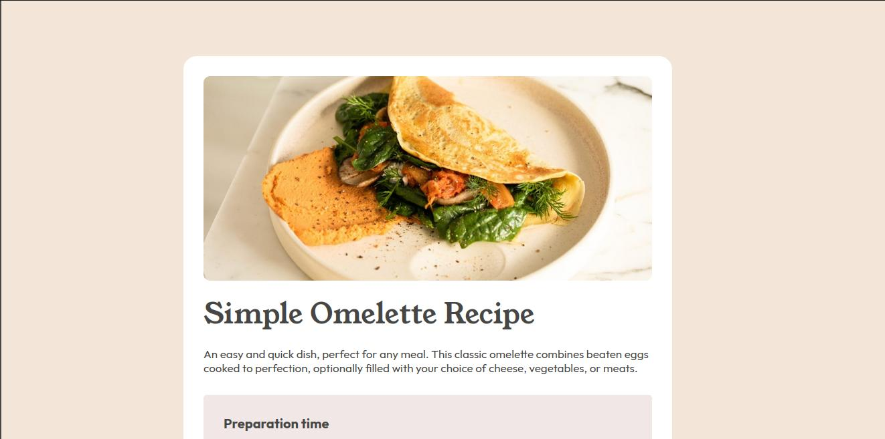

# Frontend Mentor - Social links profile solution

This is a solution to the [Recipe page challenge on Frontend Mentor](https://www.frontendmentor.io/challenges/recipe-page-KiTsR8QQKm). Frontend Mentor challenges help you improve your coding skills by building realistic projects.

## Table of contents

- [Overview](#overview)
  - [The challenge](#the-challenge)
  - [Screenshot](#screenshot)
  - [Links](#links)
- [My process](#my-process)
  - [Built with](#built-with)
  - [What I learned](#what-i-learned)
  - [Continued development](#continued-development)
  - [Useful resources](#useful-resources)
- [Author](#author)
- [Acknowledgments](#acknowledgments)

## Overview

### The challenge

Users should be able to:

- See hover and focus states for all interactive elements on the page

### Screenshot



### Links

- Solution URL: [https://github.com/ababaug/recipe-page-div]
- Live Site URL: [https://ababaug.github.io/recipe-page-div/]

## My process

### Built with

- Semantic HTML5 markup
- CSS custom properties
- Flexbox
- Mobile-first workflow

**Note: These are just examples. Delete this note and replace the list above with your own choices**

### What I learned

Use this section to recap over some of your major learnings while working through this project. Writing these out and providing code samples of areas you want to highlight is a great way to reinforce your own knowledge.

To see how you can add code snippets, see below:

```html
<body>
  <section class="container">
    <section class="content">
      <header>
        
      </header>
      <div>
        <section class="recipe">
          <h1>Simple Omelette Recipe</h1>
          <p>
            An easy and quick dish, perfect for any meal. This classic omelette
            combines beaten eggs cooked to perfection, optionally filled with
            your choice of cheese, vegetables, or meats.
          </p>
          <figure class="time">
            <figcaption>Preparation time</figcaption>
            <ul>
              <li>
                <div><strong>Total</strong>: Approximately 10 minutes</div>
              </li>
              <li>
                <div><strong>Preparation</strong>: 5 minutes</div>
              </li>
              <li>
                <div><strong>Cooking</strong>: 5 minutes</div>
              </li>
            </ul>
          </figure>
        </section>
        <section class="ingredient">
          <h2>Ingredients</h2>
          <ul>
            <li><div>2-3 large eggs</div></li>
            <li><div>Salt, to taste</div></li>
            <li><div>Pepper, to taste</div></li>
            <li><div>1 tablespoon of butter or oil</div></li>
            <li>
              <div>
                Optional fillings: cheese, diced vegetables, cooked meats, herbs
              </div>
            </li>
          </ul>
        </section>
        <hr />
        <section class="instruction">
          <h2>Instructions</h2>
          <ol>
            <li>
              <div>
                <strong>Beat the eggs</strong>: In a bowl, beat the eggs with a
                pinch of salt and pepper until they are well mixed. You can add
                a tablespoon of water or milk for a fluffier texture.
              </div>
            </li>
            <li>
              <div>
                <strong>Heat the pan</strong>: Place a non-stick frying pan over
                medium heat and add butter or oil.
              </div>
            </li>
            <li>
              <div>
                <strong>Cook the omelette</strong>: Once the butter is melted
                and bubbling, pour in the eggs. Tilt the pan to ensure the eggs
                evenly coat the surface.
              </div>
            </li>
            <li>
              <div>
                <strong>Add fillings (optional)</strong>: When the eggs begin to
                set at the edges but are still slightly runny in the middle,
                sprinkle your chosen fillings over one half of the omelette.
              </div>
            </li>
            <li>
              <div>
                <strong>Fold and serve</strong>: As the omelette continues to
                cook, carefully lift one edge and fold it over the fillings. Let
                it cook for another minute, then slide it onto a plate.
              </div>
            </li>
            <li>
              <div>
                <strong>Enjoy</strong>: Serve hot, with additional salt and
                pepper if needed.
              </div>
            </li>
          </ol>
        </section>
        <hr />
        <section class="nutrition">
          <h2>Nutrition</h2>
          <p>
            The table below shows nutritional values per serving without the
            additional fillings.
          </p>
          <table>
            <tr>
              <td>Calories</td>
              <td><strong>277kcal</strong></td>
            </tr>
            <tr>
              <td>Carbs</td>
              <td><strong>0g</strong></td>
            </tr>
            <tr>
              <td>Protein</td>
              <td><strong>20g</strong></td>
            </tr>
            <tr>
              <td>Fat</td>
              <td><strong>22g</strong></td>
            </tr>
          </table>
        </section>
      </div>
    </section>
  </section>
</body>
```

```css
@font-face {
  font-family: Outfit;
  src: url(assets/fonts/outfit/Outfit-VariableFont_wght.ttf);
}

@font-face {
  font-family: Outfit-black;
  src: url(assets/fonts/outfit/static/Outfit-Black.ttf);
}

@font-face {
  font-family: Outfit-bold;
  src: url(assets/fonts/outfit/static/Outfit-Bold.ttf);
}

@font-face {
  font-family: Outfit-extrabold;
  src: url(assets/fonts/outfit/static/Outfit-ExtraBold.ttf);
}

@font-face {
  font-family: Outfit-extralight;
  src: url(assets/fonts/outfit/static/Outfit-ExtraLight.ttf);
}

@font-face {
  font-family: Outfit-light;
  src: url(assets/fonts/outfit/static/Outfit-Light.ttf);
}

@font-face {
  font-family: Outfit-medium;
  src: url(assets/fonts/outfit/static/Outfit-Medium.ttf);
}

@font-face {
  font-family: Outfit-regular;
  src: url(assets/fonts/outfit/static/Outfit-Regular.ttf);
}

@font-face {
  font-family: Outfit-semibold;
  src: url(assets/fonts/outfit/static/Outfit-SemiBold.ttf);
}

@font-face {
  font-family: Outfit-thin;
  src: url(assets/fonts/outfit/static/Outfit-Thin.ttf);
}

@font-face {
  font-family: Youngserif-regular;
  src: url(assets/fonts/young-serif/YoungSerif-Regular.ttf);
}

* {
  box-sizing: border-box;
  margin: 0;
  padding: 0;
}

body {
  background-color: #f3e5d8;
  display: flex;
  justify-content: center;
  align-items: center;
  overflow-x: hidden;
  height: auto;
}

.container {
  border: 0;
  width: 391px;
  background-color: #ffffff;
  padding-bottom: 30px;
  color: #464644;
  box-shadow: 5px 5px 5px 5px transparent;
}

.content div {
  margin: 30px;
}

header {
  width: 391px;
  height: 167px;
}

header img {
  max-width: 100%;
}

div .recipe {
  margin-top: 40px;
}

div .recipe h1 {
  font-family: Youngserif-regular;
  font-size: 36px;
  font-weight: lighter;
}

div .recipe p {
  font-family: Outfit-regular;
  font-size: 17px;
  margin: 20px 0;
}

div .recipe figure {
  padding: 30px 30px;
  box-shadow: 5px 5px transparent;
  background-color: #f1e7e7;
  border: 0;
  border-radius: 5px;
  margin: 30px 0;
}

div .recipe figure figcaption {
  margin-bottom: 20px;
  font-family: Outfit-bold;
  font-size: 20px;
}

div .recipe figure ul {
  padding-left: 25px;
  font-family: Outfit-light;
  font-size: 17px;
  position: relative;
}

div .recipe figure ul li::marker {
  font-size: 12px;
}

div .recipe figure ul div {
  margin-left: 10px;
  line-height: 1.5;
}

div .recipe figure ul li:nth-child(2) {
  margin: 10px 0;
}

.ingredient {
  margin: 20px 0;
}

.ingredient h1 {
  font-family: Youngserif-regular;
}

h2 {
  font-family: Youngserif-regular;
  font-weight: lighter;
}

.ingredient ul {
  padding-left: 22px;
}

.ingredient ul div {
  margin: 12px 20px;
  font-family: Outfit-regular;
  font-size: 16px;
}

hr {
  margin: 40px 0;
  border-top: #e8e8e8;
}

.instruction ol {
  padding-left: 19px;
  font-family: Outfit-regular;
}

.instruction ol li::marker {
  font-weight: bold;
}

.instruction ol div {
  margin: 12px 20px;
  font-size: 16px;
}

.nutrition {
  margin-bottom: 30px;
}

.nutrition p {
  margin: 20px 0;
  font-family: Outfit-regular;
  font-size: 18px;
}

table {
  font-family: Outfit-regular;
  border-collapse: collapse;
}

.nutrition table * {
  padding: 20px 0 20px 30px;
  width: 391px;
}

.nutrition tr {
  border-bottom: 1px solid #e8e8e8;
}

@media only screen and (min-width: 720px) {
  body {
    display: flex;
    justify-content: sp;
    align-items: center;
    min-height: 2000px;
  }

  .container {
    width: 730px;
    border-radius: 20px;
  }

  .content {
    display: flex;
    flex-direction: column;
    justify-content: space-between;
    align-items: center;
    height: 1805px;
  }

  header {
    padding: 30px;
    width: auto;
  }

  header img {
    max-width: 100%;
    border-radius: 10px;
  }

  .content div {
    margin: 0 30px;
    font-size: 16px;
  }

  .content div h1 {
    font-size: 42px;
  }

  .content div h2 {
    font-size: 32px;
  }
}
```

## Author

- Website - [https://www.linkedin.com/in/augustine-stephen-abah-51103090/]
- Frontend Mentor - [@ababaug](https://www.frontendmentor.io/profile/ababaug)
